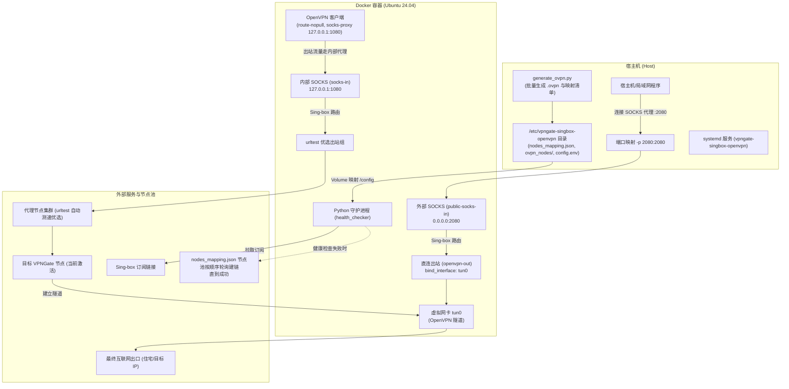

# vpngate-singbox-openvpn (Sing-box + OpenVPN 链式代理与高可用节点轮询服务)

基于 **Ubuntu 24.04**、**Sing-box 1.12.20** 与 **OpenVPN** 构建的链式代理、批量节点池管理与自动容灾服务。

本服务通过在容器内构建双向闭环链式代理，使 OpenVPN 的出站流量经由 Sing-box 的 SOCKS 入站端口进入其 `urltest` 优选组，并通过后台守护进程实时监测 OpenVPN 隧道连通性；宿主机上安装 `generate_ovpn.py` 基于从 VPNGate 下载/读取的代理节点 CSV 批量生成按带宽降序排序的 `.ovpn` 文件与 `nodes_mapping.json` 映射清单；当容器内部健康检测失败时，自动按节点优先级顺序依次尝试建立连接，直到建链成功。

---

## 🌟 核心功能与架构特性



1. **基础环境**：基于官方 **Ubuntu 24.04 LTS** 镜像，集成 **Sing-box 1.12.20**、OpenVPN 与 Python3 运行环境。
2. **宿主机批量节点生成与风控过滤 (`generate_ovpn.py`)**：
   - 宿主机一键安装全局命令 `vpngate-generate-ovpn` 与 `vpngate-node-updater`；
   - 自动批量并发查询 `scamalytics.com` 威胁风控分（0~100），**严格过滤并仅保留威胁分 < 20 的纯净住宅/低风险节点**；
   - 具备 7 天本地磁盘/内存两级缓存，大幅加速后续查询并防止重复请求；
   - 支持从本地 CSV 文件、指定 URL 或直接从 VPNGate 官方/高可用镜像源全自动下载拉取；
   - 自动按带宽速度（Speed）降序排序、过滤无效节点、提取端口与协议；
   - 批量输出 `.ovpn` 节点文件至映射目录（`ovpn_nodes/`），并生成跨环境通用的 `nodes_mapping.json` 映射清单；
   - 自动将最高速 Top 1 纯净节点设为默认初始配置（`client.ovpn`）。
3. **宿主机每日定时自动更新与重启守护 (`node_updater.py`)**：
   - 宿主机后台常驻进程 `vpngate-singbox-node-updater`；
   - **支持按国家代码精准选择节点**（支持 CLI 参数 `-c` / `--country` / `--country-code` 或 `config.env` 中的 `VPNGATE_COUNTRY`，如 `JP`、`US`、`KR` 或 `JP,US`）；
   - **每天北京时间 (UTC+8) 凌晨 00:00 至 06:00 之间的随机时刻**，自动调用 `generate_ovpn.py` 刷新节点池并过滤指定国家的最新低风险节点；
   - 刷新完成后**自动重启 Docker 容器**，无缝载入并生效最新节点池；
   - 支持通过 `vpngate-node-updater -c JP --run-now` 立即拉取指定国家节点并重启容器生效。
4. **双 SOCKS Inbound 与闭环链式路由**：
   - **内部 Inbound (`socks-in`, 127.0.0.1:1080)**：供 OpenVPN 客户端出站使用，流量自动路由至 Sing-box 订阅中的 `urltest` 优选组，经由订阅节点连接 OpenVPN 服务器建立隧道。
   - **外部 Inbound (`public-socks-in`, 0.0.0.0:2080)**：映射至宿主机 `2080` 端口，流量自动路由至 `openvpn-out`（`bind_interface: "tun0"`），使宿主机客户端的请求全部经由 OpenVPN 隧道最终出口。
5. **路由表安全保护（不修改主机/容器默认路由）**：
   - OpenVPN 自动注入 `route-nopull`，禁用 `redirect-gateway`，确保系统默认网关与原网络不受任何影响；
   - OpenVPN 客户端流量显式通过 `socks-proxy 127.0.0.1 1080` 转发。
6. **后台高可用健康检测与按顺序自动轮询建链**：
   - 守护进程通过 `tun0` 网卡接口进行定时健康探测（默认每 30 秒检查一次，正常通过时静默不刷屏）；
   - 当 OpenVPN 节点连续失败达到阈值（默认 3 次）时，**自动从 `nodes_mapping.json` 按顺序依次尝试切换节点并建链，直到建链成功**；
   - 实时将运行状态（状态、出口 IP、当前激活节点信息、失败次数、最后更新时间）写入 `vpn_status.json`；
   - 支持通过 `vpngate-tunnel next-node` 手动发送无缝热切信号。
7. **统一配置目录映射**：
   - 所有的配置文件（`config.env`、`client.ovpn`、`nodes_mapping.json`、`ovpn_nodes/`、生成的运行配置和状态文件）统一挂载在宿主机的 `/etc/vpngate-singbox-openvpn` 目录。
8. **Systemd 一键自启与服务化管理**：
   - 提供开箱即用的 Systemd 服务配置与全生命周期管理脚本。

---

## 📁 目录结构

```
vpngate-singbox-openvpn/
├── Dockerfile                     # 容器镜像构建文件 (Ubuntu 24.04 + Sing-box 1.12.20 + OpenVPN)
├── docker-compose.yml             # Docker Compose 编排文件
├── entrypoint.sh                  # 容器入口启动脚本
├── generate_ovpn.py               # VPNGate 节点批量生成与映射清单构建脚本 (安装至宿主机全局)
├── vpngate-singbox-openvpn.service # 主隧道服务 Systemd 模板文件
├── vpngate-singbox-node-updater.service # 宿主机自动定时刷新与重启守护 Systemd 模板
├── scripts/
│   ├── config_processor.py        # Sing-box 订阅解析与 SOCKS 规则注入模块
│   ├── ovpn_processor.py          # OpenVPN 规则注入模块 (route-nopull, socks-proxy)
│   ├── health_checker.py          # 后台监控、进程守护与按顺序自动故障切换模块
│   ├── node_updater.py            # 宿主机每日定时自动刷新节点并重启容器守护脚本
│   ├── install-service.sh         # 一键安装并启用 Systemd 服务脚本
│   ├── uninstall-service.sh       # 卸载 Systemd 服务脚本
│   └── service.sh                 # 常用维护管理 CLI 工具
└── config/                        # 宿主机映射配置目录 (/etc/vpngate-singbox-openvpn)
    ├── config.env.example         # 环境变量配置模板
    ├── client.ovpn.example        # OpenVPN 节点配置模板
    ├── auth.txt.example           # OpenVPN 账号密码模板
    ├── singbox_subscription.raw.json # 默认/初始 Sing-box 订阅基础配置 (自动安装)
    ├── nodes_mapping.json         # VPNGate 节点池映射清单
    ├── ovpn_nodes/                # 批量生成的 .ovpn 节点文件目录
    ├── scamalytics_cache.json     # Scamalytics 威胁分 7 天本地缓存
    └── vpn_status.json            # 实时状态输出 (容器运行时自动生成)
```

---

## ⚙️ 配置说明 (`config/config.env`)

编辑 `/etc/vpngate-singbox-openvpn/config.env` 文件配置参数：

| 配置项 | 默认值 | 说明 |
| :--- | :--- | :--- |
| `SINGBOX_SUBSCRIPTION_URL` | - | Sing-box 订阅链接（支持 JSON 或 Base64 JSON） |
| `SOCKS_INBOUND_LISTEN` | `127.0.0.1` | 内部 SOCKS 入站监听 IP（仅供容器内 OpenVPN 专用） |
| `SOCKS_INBOUND_PORT` | `1080` | 内部 SOCKS 入站端口（仅供容器内 OpenVPN 专用） |
| `PUBLIC_SOCKS_PORT` | `2080` | 外部公开 SOCKS 端口（映射至宿主机，供宿主机或局域网使用） |
| `TARGET_URLTEST_TAG` | 空 (自动检测) | 指定路由的目标 urltest 出站组 Tag，留空自动检测 |
| `OPENVPN_USE_PROXY` | `false` | OpenVPN 出站是否通过代理 (默认 `false` 直连出站；设为 `true` 时通过 Sing-box 127.0.0.1:1080 SOCKS 出站) |
| `OPENVPN_CONFIG_FILE` | `client.ovpn` | OpenVPN 配置文件名（存放在 config 目录下） |
| `OVPN_REMOTE_URL` | - | 备用：当本地节点池耗尽时远程拉取新 `.ovpn` 文件的 URL |
| `OPENVPN_AUTH_USER` | `vpn` | OpenVPN 认证用户名 (VPNGate 默认 `vpn`) |
| `OPENVPN_AUTH_PASS` | `vpn` | OpenVPN 认证密码 (VPNGate 默认 `vpn`) |
| `CHECK_INTERVAL` | `30` | 健康检查探测间隔（单位：秒，通过时静默不刷屏） |
| `CHECK_FAIL_THRESHOLD` | `3` | 触发故障切换的连续失败次数阈值 |
| `CHECK_TARGET_URL` | `https://api.ipify.org` | 用于通过 tun0 探测连通性的目标测试 URL |
| `CHECK_TIMEOUT` | `10` | 单次网络探测超时时间（秒） |
| `AUTO_UPDATE_START_HOUR`| `0` | 宿主机节点定时刷新窗口起始时间 (北京时间 0-23) |
| `AUTO_UPDATE_END_HOUR`  | `6` | 宿主机节点定时刷新窗口结束时间 (北京时间 0-23) |
| `VPNGATE_COUNTRY`       | 空 (不过滤) | 刷新节点时的目标国家代码过滤 (如 `JP,US,KR`) |
| `VPNGATE_MIN_SPEED`     | `0.0` | 刷新节点时的最小带宽过滤阈值 (Mbps) |
| `VPNGATE_LIMIT`         | `100` | 刷新节点时保留的最大优质节点数 |
| `VPNGATE_MAX_THREAT_SCORE`| `20` | Scamalytics 威胁分最大允许阈值 (严格低于该值) |
| `MIXED_INBOUND_PORT` | `0` | 可选：是否额外开放 HTTP/SOCKS 混合入站端口（0 表示不开放） |

---

## 🚀 快速上手与运行指南

### 1. 一键安装与平滑升级 (推荐)

运行 `install.sh` 脚本支持**全新安装**与**平滑升级**（自动检测已有安装；升级时预构建镜像并保留现有配置与可用节点池，实现秒级无缝重启切换）：

```bash
cd /home/jason/code/vpngate-residential-tools/vpngate-singbox-openvpn

# 方式 1：平滑升级已有服务（或直接运行 vpngate-tunnel upgrade）
sudo ./install.sh --upgrade

# 方式 2：带参数安装/升级（如指定仅使用日本 JP 节点）
sudo ./install.sh \
  -s "https://your-singbox-subscription-url..." \
  -p 2080 \
  -c JP \
  --csv "./ovpn.csv"

# 方式 3：默认安装 (自动拉取最新 VPNGate 节点池)
sudo ./install.sh
```

### 2. 宿主机节点池生成与定时自动更新

安装后系统全局提供了 `vpngate-generate-ovpn`、`vpngate-node-updater` 与 `vpngate-tunnel`：

```bash
# 自动从 VPNGate 官方/镜像拉取最新节点并按带宽生成 Top 100 节点池
vpngate-generate-ovpn

# 基于指定国家代码（如日本 JP、美国 US）生成纯净节点
vpngate-generate-ovpn -c JP --limit 50

# 仅保留带宽大于 20 Mbps 的节点
vpngate-generate-ovpn --min-speed 20.0

# 触发 node_updater 立即拉取指定国家节点并重启容器生效
vpngate-node-updater -c JP --run-now
```

### 3. 全局日常管理命令 (`vpngate-tunnel`)

可在系统任意位置直接使用 `vpngate-tunnel` 进行管理：

```bash
# 平滑升级服务至最新版本 (自动预构建镜像、合并新配置项、秒级无缝重启)
vpngate-tunnel upgrade

# 查看服务运行状态、当前激活节点及 VPN 出口 IP
vpngate-tunnel status

# 列出当前节点池清单 (国家、IP:端口、带宽、Ping)
vpngate-tunnel list-nodes

# 手动触发立即切换至下一个可用节点
vpngate-tunnel next-node

# 重新拉取 VPNGate 节点并更新映射清单
vpngate-tunnel update-nodes

# 查看实时运行日志
vpngate-tunnel logs

# 重启隧道服务
vpngate-tunnel restart

# 在容器内测试 tun0 连通性
vpngate-tunnel test
```

### 4. 方式 B：使用 Docker 手动运行

如果不需要注册为 systemd 系统服务，可以直接运行：

```bash
# 1. 宿主机生成节点池
python3 generate_ovpn.py -s ./ovpn.csv -d ./config/ovpn_nodes -m ./config/nodes_mapping.json

# 2. 构建镜像
docker build -t vpngate-singbox-openvpn:latest .

# 3. 启动容器 (映射 config 目录与网络特权)
docker run -d --name vpngate-singbox-openvpn \
    --restart unless-stopped \
    --cap-add=NET_ADMIN \
    --device=/dev/net/tun:/dev/net/tun \
    -v $(pwd)/config:/config \
    -p 2080:2080 \
    vpngate-singbox-openvpn:latest
```

---

## 📊 运行状态检查 (`vpn_status.json`)

容器运行后，后台守护进程会实时将健康状态及当前激活节点写入 `config/vpn_status.json`，可通过 `vpngate-tunnel status` 或 `cat /etc/vpngate-singbox-openvpn/vpn_status.json` 查看：

```json
{
  "status": "UP",
  "exit_ip": "219.100.37.18",
  "fail_count": 0,
  "active_node": {
    "id": "Japan_219.100.37.18_443",
    "ip": "219.100.37.18",
    "port": "443",
    "proto": "tcp",
    "country": "Japan",
    "country_short": "JP",
    "speed_mbps": 841.12,
    "index": 0,
    "total_nodes": 99
  },
  "last_check": "2026-08-21T17:35:00.123456",
  "last_switch": "2026-08-21T17:30:15.654321",
  "last_error": "",
  "singbox_running": true,
  "openvpn_running": true,
  "tun_interface_up": true
}
```

---

## 🛠️ 卸载服务

如需卸载 systemd 服务及容器：

```bash
sudo ./uninstall.sh
# 如需连同 /etc 配置文件与节点池一并清理：
sudo ./uninstall.sh --purge
```
